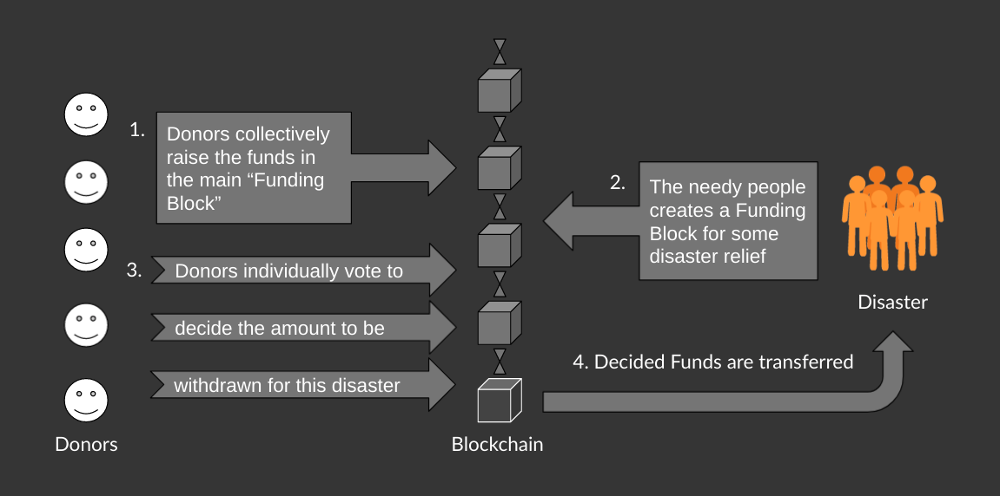

The problem Funding Blocks App solves
Funding Blocks App is the first of Defi kind Decentralised donation app. It eliminates majority of obstacles and risk factors that we face while Donating relief funds. It ensures the transparency in a trustless environment, enabling rapid action to any disaster in the world.
The problem Funding Blocks App solves
Where's the Problem?
People donate less
No trust in the organizations
They don’t get anything in return
Sometimes It takes weeks to raise the minimum amount needed
Average person gets aware in around 24 hours
Spreading awareness consumes the majority of the time
Some people are ready to contribute but don’t have funds on time
What if they raised 300k but only used 250k?
No one knows
But the donors have a right to know
🎁 Presenting Funding Blocks
Donors can raise funds before a calamity has occurred
They get a Certificate for donation as NFT
Funds cannot be stolen
They cannot be withdrawn without any need
Total amount collected is always transparent
The total time can be just a couple of minutes
Donors vote for the amount to be withdrawn
Amount withdrawn is fully transparent
🔎 About the Project
Funding Blocks is the First its kind decentralized donation app. It eliminates the majority of obstacles and risk factors that we face while Donating relief funds. It ensures transparency in a trustless environment, enabling rapid action to any disaster in the world.

🤔 But, how does it work?

Funds Transfer -
Donors vote for the withdrawal amount
The voting process continues until
25% of the total donors have voted or
50% have downvoted it
If ≥ 50% have downvoted, the Funding Block is canceled
Else, the funds are transferred to the organization.
🏁 Key Differentiators
✅ Trustless: Donors decide the amount

✅ Speed: Voting takes just a few hours

✅ Transparent: All numbers are public

✅ Decentralised: Power is distributed

✅ Reward: Donors get Certificate NFT

Challenges I ran into
📚Learning the Technology - Our team was new to blockchain development, and none of us was having any prior experience with it. Migrating from solidity or other languages is fairly easy, but in our case, we started from scratch.
First, we learned about the fundamentals of Blockchain, then some cryptocurrencies, and then about Smart Contracts. Finally, we started with Tezos, here most of the concepts and libraries were new to us. So, we spent the majorit of time reading docs and understanding other projects.

⚠️Vulnerabilities - While developing our project, we realized that the current voting algorithm was vulnerable to fake account attacks. Where if someone has the majority of alternate wallets, they might create a fake funding block, and send their own fake votes for large money to withdraw. Eventually taking out most of the money.

We solved this problem by changing our algorithm to proportional averaging, this simply applies the concept of "The more you donate, the more your vote matters". This eliminates the above issue and distributes the power reasonably. Also, we use memorization with a Dynamic Programming approach to reduce the gas fees usage. So instead of iterating on all the voters each time (O(n^2)) we reduced the computation to O(n).

Somewhat similar way is used to calculate the total upvotes (likes), the 'percentage likes' is added each time someone likes, in proportion to the amount donated.

🌐Language Barrier - We also, realized that if this Project is being made to help everyone globally, we should remove the barrier of language. So we added support for 100+ languages. This increases the usability of the website for the whole world. Now anyone who has a problem with English can set their suitable language. Now, more people would be able to use our site effectively, eventually increasing the organic traffic.

🏆Integrating NFT - Learning about the FA2 standard and using it to mint NFT was quite confusing.

Technologies I used
Progressive Web Apps (PWA)Google Maps APIGoogle Translate APIReact RouterTezosSmartPyNFTTaquitoReact.jsFA2

What if donations become transparent? Introducing a new and decentralised way to help!

<a href="https://youtu.be/0XVJO3rAd8M">View Demo</a>

  
<b>Table of Contents</b>

  <ul>
    <li>
      <a href="#about-the-project">About The Project</a>
      <ul><li><a href="#built-with">Built with</li></ul>
    </li>
    <li><a href="#wheres-the-problem">Where's the Problem?</a></li>
    <li><a href="#presenting-funding-blocks">Presenting Funding Blocks</a></li>
    <li>
      <a href="#how-it-works">But, how does it work?</a>
      <ul><li><a href="#funds-transfer">Funds Transfer</a></li></ul>
    </li>
    <li><a href="#key-differentiators">Key Differentiators</a></li>
    <li><a href="#quick-start">Quick Start</a></li>
    <li><a href="#team">Team</a></li>
    <li><a href="#license">License</a></li>
  </ul>

# 🔎 About the Project

[Funding Blocks App](https://fundingblocks.ml/) is the First of it's kind decentralised donation app. It eliminates majority of obstacles and risk factors that we face while Donating relief funds.
It ensures the transparency in a trustless environment, enabling rapid action to any disaster in the world.

### Built With

-   React
-   Bootstrap
-   Tezos
-   SmartPy

# ❓ Where's the Problem?

-   People donate less
    -   **No trust** on the organisations
    -   They don’t get anything in return
-   Sometimes It takes **weeks** to raise the minimum amount needed
    -   Average person gets aware in around 24 hours
    -   Spreading awareness consumes majority of time
    -   Some people are ready to contribute but don’t have funds on time
-   What if they raised 100k but only used 80k?
    -   No one knows
    -   But the donors have a **right to know**

# 🎁 Presenting Funding Blocks

-   Donors can raise fund before a calamity has occurred
    -   They get Certificate for donation as NFT
    -   Funds cannot be stolen
    -   They cannot be withdrawn without any need
-   Total amount collected is always transparent
    -   The total time can be just a couple of minutes
    -   Donors vote for the amount to be withdrawn
    -   Amount withdrawn is fully transparent

# 🤔 But, how does it work?

## Funds Transfer -

-   Donors vote for the withdraw amount
-   The voting process continues until
    -   25% of the total donors have voted or
    -   50% have downvoted it
-   If ≥ 50% have downvoted, the Funding Block is canceled
-   Else, the funds are transferred to the organisation.

# 🏁 Key Differentiators

✅ **Trustless**: Donors decide the amount

✅ **Speed**: Voting takes just a few hours

✅ **Transparent**: All numbers are public

✅ **Decentralised**: Power is distributed

✅ **Reward**: Donors get Certificate NFT

# ⚡️ Quick Start

##### `Install server dependencies`

-   npm install

##### `Install client dependencies`

-   cd client
-   npm install
-   npm start

##### `Build for production`

-   cd client
-   npm run build

Check in browser on http://localhost:3000/

# Results and Outcomes 

The entire workflow of Donation App can be explained as follows

# 📝 License

This project follows the [MIT License](LICENSE).
